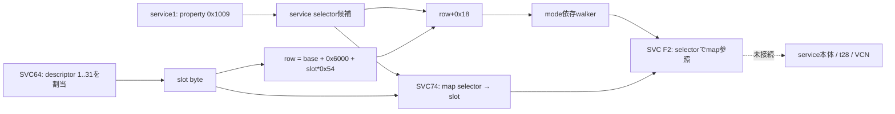

# R232 — 登録・dispatch契約の再照合

STAGE=R232  
RESULT=PROVEN_STATICALLY  
STATIC_OR_LIVE=STATIC  
HARDWARE_ACCESS=NONE  
HARDWARE_MUTATION=NONE  
HARDWARE_FAILURE=NO_EVIDENCE  
PROVEN=Saved allocator, row selector, registration/lifecycle contracts; previous-record corrections  
REJECTED=Separate 12-byte writer; absence of saved SVC64 evidence; uniform user-pointer file mapping  
UNPROVEN=Running image identity, live occupancy, t28/AUTOLOAD connection, VCN acceptance and execution  
NEXT=On next research instruction, resolve service1 image provenance and missing version-matched text

2026-09-23。保存済み解析テキスト・CPUモデル・公開ソースによる研究。実機アクセス、実機変更、外部コード実行なし。研究時間は20:24–21:24 JST。以下は研究終了後に整理した引き継ぎ。

## 結論と過去記録の訂正

SVC `0x64` の割当実装は、R218ですでに保存・説明されていた。R230/R231と今回の着手前計画にある「保存資料に実装がない」「割当範囲不明」は、古い証拠を引き継ぎ損ねた記録上の誤りだった。R232は新しい公開firmware blobから発見したのではなく、R218の根拠を復元し、命令バイト・分岐・境界条件を再検証した。

さらに、R225の「SVC74 writerは別の12-byte stride」という解釈を訂正する。Ghidraが関数先頭と見なした位置の直前で、すでにslotに7を掛けている。続く3倍・4倍を合わせて `slot * 7 * 3 * 4 = slot * 0x54`。同じ行の `+0x18` にservice selectorを書き込み、同じselectorとslotをSVC74へ渡す。

座標にも引き継ぎの退行があった。R228/R229はuser絶対pointer `0x206080` をbody `0x6080` と書いているが、これはR218で区別済みのuser section mappingを無視したもの。R218の対応を用いた候補body offsetは `0x14080` であり、`body 0x6080` の値 `0x16000` をuser contextの初期値と認定しない。またrow式のbaseは `*(u32 *)0x206080` の1回の読出しであり、R229の二重dereference表記は不正確。保存startupの明示的な `0x280000` storeと、そこからの `0x286000` 計算はこの訂正後も成立する。

一方、実行中のTOS同一性、実際の登録数、t28との接続、VCNの受理・実行は未証明のまま。最後の実験R199_R173の `status=0xffff0008`、配置0を今回の静的結果で成功へ更新しない。

## 根拠の版と座標

- 保存TOS本文: 82,256 bytes、SHA-256 `19f091ded7bea3ee3c61adc3b6a7e1d2a48c8a7817f885bdb43b9c1f2b6bc43d`。
- 保存containerのversion欄 `0x1c0002`、保存Robin1/Robin3の同一本文。実行中の版を証明する値ではない。
- 本ノートのコード位置は原則 **body offset**。Ghidraテキストは人工base `0x200000` を加えた座標を使用。
- kernel側のliteral値 `0x69b0` / `0x8430` と、user側の絶対pointer `0x206080` 等を同じファイル座標にしない。R218のuser section対応 `body 0xe000 → address 0x200000` はSTRONGLY_SUPPORTEDであり、live relocationの観測ではない。
- `0x286000` はR228/R229の保存startupが設定するcontext base `0x280000` に `0x6000` を加えた条件付き計算結果。

28個の既存exportのhashを確認し、4,926命令の保存byte列を本文に照合。37命令はbyte付きexportがなく、モデルで実行しない。モデルで使う95 literalもLE32で照合。追加の4 literalはcleanupのpoolを既存本文から数値比較したもの。新しいdisassemblyは行っていない。

## 登録に至る契約

実線は保存コードの条件付き接続。実行時の成功を表す図ではない。

| 段階 | 保存コードと入力 | 確認できた出力・境界 |
|---|---|---|
| 特殊bootstrap | `0x11b60..0x11b90`、entry-SP第1引数が非zero | selector=1、allocation class=2。通常のproperty取得を通らない |
| 通常DR image | marker `0x5244`、`0x11bcc → 0xfe64` | property取得成功時は `amd.dr.driverID` の値をr5に保持 |
| property取得 | `0xfe64 → 0xf10e → SVC F2` | **service 1**、request first word `0x1009`。単純なローカル文字列parserではない |
| request形式選択 | `0x1002c`、cache `0x206140` | cache=0ならservice 1へ`0x103b`。失敗時は形式1へfallback。形式1/その他でpointer欄が異なる |
| class選択 | `0x11bd0..0x11be2` | helper戻り値2/3/4ならclass4、それ以外はclass6。TA marker `0x4154` は別にclass5 |
| 重複確認 | `0xfe08` / R230 | row先頭非zero・DR tag・16-byte key一致で既存slotを返す。miss `0xff` は新規割当の入力行番号ではない |
| descriptor割当 | `0x11cc0 → SVC64 → 0x49ba → 0x180c` | loaderのclass2/4/5/6では空きdescriptor 1..31の先頭を選び、出力byteにslotを返す |
| row初期化 | `0x11cc6`以降 | 同じslotの0x54-byte行をclearし、tag・key等を書く |
| payload出力境界 | `0x11d56..0x11d9a`、SVC67 `(slot, total_size, &out)` | status=0なら出力値をrow+0、sizeをrow+4に格納。helper `0xcb4` の本文は今回のexport集合にない |
| selector書込み | `0x121d6..0x121ee` | `base + 0x6000 + slot*0x54 + 0x18` にr5を書き込む |
| service登録 | `0x121f6`、SVC74 `(selector, slot)` | wrapper `0x4c82` はslot引数をbyteへ縮め、helper `0x37ec` がservice mapを更新 |
| 初期通知 | `0x121fe..0x1221c` | 登録成功かつselectorが1/3以外ならF2(selector, request first word=`0xffff0002`)。この成功もloaderの成功条件 |

**property取得の注意:** `0xfe64` はproperty要求が失敗した場合、その非zero statusをそのまま返す。従ってr5を無条件に「取得済みdriverID」と呼べない。通常DR callerは同じ戻り値をselector候補として保持する。これは保存コードの返り値契約の確認であり、実際に失敗が起きた、または任意imageが受理されたという証拠ではない。

## SVC64: R218証拠の復元と境界条件

relative dispatch tableのbaseは `0x45e4`。SVC64のentryは `0x4630`、保存LE32値 `0x3d6`、遷移先 `0x49ba`。wrapperは現在contextのclass byteが1でなければ `0xe`、出力pointer検証 `0x158c` が非zeroならそのstatusを返し、成功時にallocator `0x180c` を呼ぶ。

allocatorはraw literal `0x69b0`、stride8のdescriptorを使う。通常loader classではindex1から31まで昇順走査し、先頭wordのbit31が0の最初のdescriptorを選ぶ。全占有なら `0xb`。class2では空き発見後にbyte `[0x6006] == 0xff` も必要で、違えば `0x30`。したがって全占有時はclass2の状態検査より `0xb` が先に決まる。

| class | descriptor第2word | 備考 |
|---|---|---|
| 2 | `0x511` | 特殊bootstrap側。追加状態条件あり |
| 4 / その他のdefault | `0x4541` | loaderの通常DR selector2/3/4ではclass4 |
| 5 | `0x5401` | TA側 |
| 6 | `0x4441` | 通常DRのその他selector候補 |

第1wordは既存値にclassとbit31をORする。high-water byte `[0x60b4]` は選択indexが大きい場合だけ更新し、出力pointerには1 byteを書く。

class1は別契約でdescriptor0を `0x80000001 / 0x4505` に初期化し、成功しても出力pointerを書かない。従って「SVC64の全成功が1..31を返す」と一般化しない。**31個の通常割当可能slotは、31個のDR行が実在・占有する証拠ではない。** TA等もこのdescriptor領域を共有する。

## row+0x18、service map、F2は別の層

SVC74 helper `0x37ec` は、まずdestinationを `0x1724` で検証する。destination<32かつdescriptor第1wordのbit31=1が必要で、失敗は `0x25`。その後service<16を検査し、失敗は `0x2e`。成功時だけbyte `[0x8430 + service] = destination` を書く。これはrow自体とは別の16-byte mapである。

F2入口 `0x1ab8` は同じ `0x8430` を読み、selector>=16なら `0x2e`、map値0なら `0x2f` を返す。service1以外ではcaller descriptorのbit7も必要で、service3にはcaller context class1という追加条件がある。違反は `0xe`。この後にstack/address条件・destination側の4枠の空き等が続き、空きなしは `0x31`、範囲不一致は `0x32`。

今回のF2モデルは最初のcontext copyより前まで。scheduler、service image本体、serviceの返答生成は実行・モデル化していない。これらの小さいgate statusを、過去実機の `0xffff0008` の発生源と断定しない。

## 登録後の解除と残る値

cleanup `0x13020` の通常DR経路は、slot<32、row+0非zero、selector!=1等の条件を満たすと、F2(selector, `0xffff0003`)→SVC74(selector,0)→SVC85(slot)→buffer処理→rowの論理解除→service1 request `0x1001`→SVC65(slot)と進む。

SVC74(selector,0)がmapを0にするにはdescriptor0の検証が成功する必要がある。F2側ではmap0が未登録sentinelになる。cleanup callerはこれら複数SVCの戻り値を検査せず進むため、実際の解除完了は呼出しの存在だけで証明できない。

行の先頭、tag(+8)、byte+0x1dはclearされるが、selector(+0x18)は残る。従って将来メモリー観測が得られても、**非zero selectorだけを占有数として数えない**。duplicate検索はrow先頭も見る一方、walkerはtagを見る。終了値はservice1 request `0x1001` helperの戻り値を保持する。この違いは、単なる数値scanをlive登録の証拠にしないために重要である。

## `0xfc50` walkerの条件とcommand

保存initializer `0x11746..0x1174c` はmode byte `[0x2060f5]` が非zeroのときwalkerを呼ぶ。`0x115b6` にはこの関数への直接BLがなく、別の状態byte・同期SVCを操作する。間接的な接続の可能性を否定するものではないが、直接callerとは記録しない。非zero modeのwriterは今回の保存export範囲では特定できなかった。

| phase | 順序と対象 | mode=1 | mode=2 | その他nonzero |
|---|---|---|---|---|
| 前半 | slot31→0、tag5244、selector!=3 | `0xffff0000` | `0xffff0004` | `0xffff0004` |
| 前半のselector3 | 同じ行順序 | 呼ばない | **F2(3,1)**、第2引数は即値1 | 呼ばない |
| phase間 | SVC7aへmodeを渡す | 1 | 2 | その値 |
| 後半 | slot0→31、tag5244、selector!=3 | `0xffff0001` | `0xffff0005` | `0xffff0005` |

通常行の第2引数はstack上のrequest pointerで、表の値はそのfirst word。selector3の即値1と混同しない。前半通常行はF2が非zeroの間同じ行を繰り返す。後半は最初の非zeroで失敗経路へ進む。前半selector3の返り値はwalkerの結果変数へ代入されない。終了処理はmode byteをclearする。

これはmode依存の二段階通知の静的契約であり、名前をAUTOLOAD、suspend/resume等へ確定する証拠ではない。32行全走査と31行占有も別である。

## 外部AUTOLOAD/op-id-8記述との照合

固定版のcommunity guideはtable `0x286000`、tag5244、31 entries、`0x115b6→0xfc50`、operation id8、t28 tag1024、clamp releaseを一つの説明としている。今回一致したのは保存TOSの計算base・tag・行構造・F2 selectorまでであり、説明の全接続ではない。

別の、今回byteで確認した経路もある。保存host command dispatcherのcommand8はTBB `0x10582 + 2*byte[0x10582+8] = 0x1064e`、call `0x1065a → 0xf18c` を経てservice1 request `0x1024` を作る。Linuxの固定版headerではhost command8は **SAVE_RESTORE**、AUTOLOAD_RLCは **0x21**。従って数値8や1024を見つけただけでAUTOLOADとの接続は成立しない。外部の「operation array id8」がhost command8と同じとも主張しない。

service1 `0x1024` wrapperは形式1なら3引数をrequest+0x38/+0x3c/+0x40へ格納し、その他形式なら2個のbuffer descriptor（各length0x400）と+0x40のscalarを使う。本文の受信先・t28 handlerは未接続。このwrapperが存在することから、危険なsave/restore試験を追加する方針にはしない。

## 次に必要な根拠

| 未接続の項目 | 必要な根拠 | 現時点の扱い |
|---|---|---|
| 実行中TOSと保存hashの一致 | 同じbootに帰属するimage identity、または検証可能なloader選択証拠 | UNPROVEN |
| service1 imageの実体 | R218のboot-context+0x23c・mapping状態とimage範囲の対応 | 静的なboot/manifest調査を優先 |
| SVC67 worker | 同一版の既存テキスト `0xcb4`、または適法な一次仕様 | caller出力以上は主張しない |
| nonzero walker modeのwriter | 同一版のcaller/状態遷移と到達条件 | AUTOLOAD等の名称を保留 |
| 外部op-id8→t28→VCN | 対象hash、各handlerの入力schema、連続するcall/data-flow | 番号一致だけでは採択しない |
| live登録・占有 | tag/row先頭/selector/descriptor/mapを同じ時点で区別できる観測経路 | PSP-private領域への安全な観測経路は未確立 |

新しい実機変更でこれらを判別できる操作点はまだ得られていない。既知のLOAD_IP_FW再試行やccp mailbox導入だけでは、この静的な未接続箇所は解消しない。次回は保存boot情報・image inventoryを使ってservice1の同一性を詰める。実機試験を必要とする仮説が具体化した時点で、単一変数・成功/失敗観測・通常復帰を揃えて準備する。

## 研究方法の限界

`text_arm_model.py` は既存命令テキストの必要部分だけを解釈するCPU上の小さな検証器。未対応命令、未seedのmemory read、byte根拠のない命令は失敗する。SVC/helper hookの成功・失敗値は仮定であり実測ではない。命令モデルと独立に記述した期待契約を比較し、分岐順序、出力欄、stride、境界値を検査した。検査件数は実機試験数でも全firmware coverageでもない。

正規条件9,563件がPASSし、実際にモデルで通った保存命令位置は580個。これとは別に、誤った12-byte stride、slot31の除外、service上限を32とする解釈をモデル内だけに入れた3つのnegative controlがすべて拒否された。firmware fileの変更・生成はしていない。byte照合4,926命令と、モデルで確認した580命令位置の範囲を混同しない。

## 参照

- ローカルR218: `descriptor-source.txt`, `boot-descriptor-svcs.txt`, `instructions.txt` とcanonical handoff。
- ローカルR217: `svc-dispatch.txt`, `service-registration.txt`, `registration-caller.txt`, `t02-candidate-functions.txt`, `dispatcher.txt`, `load-and-response.txt`。
- Linux固定commit `704340f1cd0dcef829eb62f5b48ae95a2ce17bdf` の `psp_gfx_if.h`, `psp_v11_0.c`, `amdgpu_psp.c`。host interface名の根拠であり、PSP内部op-arrayの仕様ではない。
- 外部guide固定commit `b6014e44087e`（取得manifestに完全URL/hash）。二次資料のため元の実測や版一致を代替しない。

## 再現と関連資料

- [自己完結したCPU検証セット](../logs/R232/README.md)（firmware不要）。
- [R218の元の引き継ぎ](CHATGPT_HANDOFF_R218.md)と[保存命令export](../logs/R218_instructions.txt)。
- [mailbox/transport比較](R232_TRANSPORT_CONTRACT.md)。
- [外部研究へ確認したい一次根拠](R232_EXTERNAL_EVIDENCE_QUESTIONS.md)。直接送信・同期はしていない。
- [実機検証の必要性評価](../logs/R232/live-readiness-assessment.json)。今回は追加の実機試験を準備する段階に至っていない。
- [固定版community guide](https://github.com/katzzero/bc250-unofficial-community-guide/blob/b6014e44087eed5859722bb7a8d9410d31ecec87/02-bios-and-firmware.md)。
