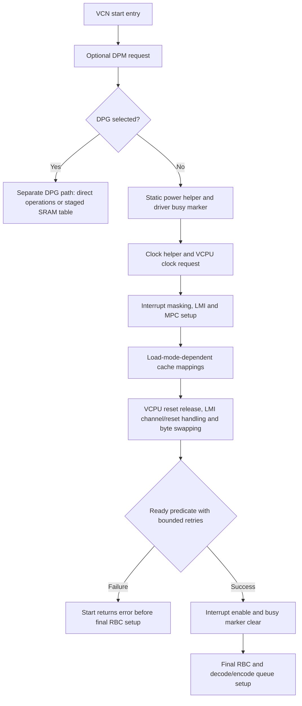

# R251–R260: VCPU startup boundary after the September 30 external report

The external report changes the most useful question to: **which VCPU startup boundary is actually observed under the reported RBC/cache-access conditions?** It does not yet establish that the VCPU executed no instructions, that the historical firmware rejection has disappeared, or that a particular reset bit is the cause.

The strongest new source distinction is generation-specific: the inspected VCN 2.0 driver releases `UVD_SOFT_RESET.VCPU_SOFT_RESET`; VCN 2.5 and later sampled drivers use `UVD_VCPU_CNTL.BLK_RST`. The latter bit value, `0x10000000`, is named `CABAC_MB_ACC` in the 2.0 header. An equal bit number and register name do not establish equal semantics. The 2.0.0 reference header is not an independently validated register specification for BC-250's 2.0.3 silicon.

This checkpoint is static research and offline interpretation. There is **no new VCN execution, hardware decode, boot change or firmware-load result**. Q36 was used for advisory review through GPU compute; that does not constitute VCN testing.

## Evidence and source identity

- User-supplied September 30 Discord summary: RBC/ring behavior and VCPU cache-register access reportedly work, while VCPU execution/startup remains unresolved. Original captures, precise register/interface names, read methods and a matching source/boot configuration were not supplied. These remain attributed external observations.
- Current reference: Linux commit [`551c722f40809618230001baccf219193e22fc5a`](https://github.com/torvalds/linux/commit/551c722f40809618230001baccf219193e22fc5a), pinned by file hashes. This is not the identity of the loaded local module or an external custom kernel.
- Historical controls: v5.4, v5.15, v6.6, v6.12 and v7.2, plus the current pin. Five header/driver families compare VCN 2.0, 2.5, 3.0, 4.0 and 5.0.
- Retained R152 diagnostic source and the previously saved VCN firmware file were read offline. Neither is evidence of current resident bytes.
- R249 is a prior public CPU frame-delivery checkpoint. R250's overnight Q36 mission did not produce an accepted completed report. Neither was silently promoted to a completed VCN experiment.

## Findings that change the comparison

| Question | What the source establishes | What remains open |
|---|---|---|
| Which reset field? | 2.0 reference uses `SOFT_RESET.VCPU_SOFT_RESET`, mask `0x8`; later sampled families use `VCPU_CNTL.BLK_RST`, mask `0x10000000` | Exact BC-250 field applicability and observed value |
| Is clock enable enough? | `VCPU_CNTL.CLK_EN` is mask `0x200`; the clock helper also handles separate RBC/VCPU gate and mode fields | Actual clocks and power domains |
| What does status mean? | Normal ready test uses mask `0x2`; driver busy uses `0x4`; `VCPU_REPORT` spans mask `0xfe`, shift 1 | Validity, origin and freshness of a particular read; partial execution before ready |
| Does RBC prove VCPU startup? | Normal ready polling precedes final RBC setup; DPG has a different contract | The external command's implementation, independent effect and startup path |
| Does ring allocation success prove start success? | The void begin-use path does not propagate the startup return into ring allocation | Actual ring-test outcome and any pre-existing state |
| Does cache access prove firmware fetch? | PSP placement and driver allocation feed different cache-mapping branches | Exact cache interface, accepted/resident bytes and instruction fetch |
| Does `RB_NO_FETCH=1` identify a defect? | Both inspected start paths set it during initialization; neither contains an explicit same-function zero assignment | Ownership and timing of later transitions, including firmware behavior |
| Does harvesting 3 mean complete isolation? | Reference names decode as MMSCH_DISABLE and UVD_DISABLE | Physical scope, effective policy and pre-ABL writer |
| Can standard debug output supply the full tuple? | The 33-register VCN2 dump list omits key VCPU reset/control/cache registers | Availability and validity of already-collected matching observations |

The reset comparison is supported by the pinned [2.0 driver](https://github.com/torvalds/linux/blob/551c722f40809618230001baccf219193e22fc5a/drivers/gpu/drm/amd/amdgpu/vcn_v2_0.c), [2.0 header](https://github.com/torvalds/linux/blob/551c722f40809618230001baccf219193e22fc5a/drivers/gpu/drm/amd/include/asic_reg/vcn/vcn_2_0_0_sh_mask.h), and [2.5 driver](https://github.com/torvalds/linux/blob/551c722f40809618230001baccf219193e22fc5a/drivers/gpu/drm/amd/amdgpu/vcn_v2_5.c). R257 records the remaining families and exact witnesses.

## Normal startup and its branch boundaries

R251 inventories 28 ordered source phases and indexes 134 register-access call sites across eight startup/helper/test functions. The call-site index retains source lines and expression hashes; branches and loops are not flattened into a runtime trace. This condensed diagram describes source control flow, not a manual register procedure or a proven hardware dependency graph.

Both the ready-before-RBC ordering and the principal reset/clock definitions persist across all six sampled revisions. Full sequences are not identical: shared decode-queue reset handling is absent in the sampled v5.4 source and present from the sampled v5.15 onward. The audit does not identify the precise introduction commit.

DPG does not contain the normal `status & 2` loop. Its indirect macro appends offset/value pairs to host staging memory; those values, including cache placeholders, are not final live register reads. The subsequent SRAM update uses VCN RAM firmware identities. The MMSCH startup inspected here belongs to the SR-IOV path. Regular VCN type 13 decimal (`0x0d`) and MMSCH type 19 decimal (`0x13`) remain distinct.

Current upstream discovery's 2.0.3 branch adds no VCN IP block. The normal 2.0 code is therefore a reference contract, not upstream native BC-250 enablement. An external patched kernel must be identified separately. Cyan initialization can use discovery tables or a fallback that assigns IP versions statically, including 2.0.3. A driver-reported version is therefore not automatically independent silicon-discovery evidence; the actual branch needs attribution. The retained R152 source explicitly skips Cyan hardware initialization and rejects its start path; this says nothing by itself about today's loaded module.

## Why a successful-looking observation may be insufficient

**Return values:** ring allocation calls a void begin-use helper, which ignores the power/start callback's return. A zero allocation return cannot certify startup. The later ring test remains a separate observation. The power-state wrapper also has VF and same-software-state success returns before start/stop, so wrapper success does not prove a fresh start attempt. The static power helper also discards PGFSM wait returns, and both normal policy branches request configuration; zero capability flags do not mean no power requests. The Cyan PPT initializer lacks the VCN enable callback inspected here, and the missing-callback path returns zero. That is a software result, not a power measurement.

**Status freshness:** the host busy expression preserves other input bits at the C expression level. A pre-existing ready bit, if it persists, satisfies the later predicate. This is a conditional scalar example, not a demonstrated stale-status bug: hardware reset/power effects are not modeled, and normal stop explicitly clears status. All-ones also satisfies the predicate without establishing read validity. Conversely, no ready report cannot exclude execution that stopped before the handshake.

**Read provenance:** SOC15 indices depend on the IP/instance base and BASE_IDX; direct MMIO helpers convert dword indices to byte offsets. Dispatch can involve an RLC helper. One generic helper returns software zero when hardware access is skipped. These facts require identifying the actual acquisition path; they do not diagnose any external read as invalid. No physical register address was inferred from a header index alone.

**Observable side effects:** host code initializes firmware-log headers and pointers, so their existence is not a heartbeat. Reading the firmware-log debugfs file advances its shared read pointer despite file mode 0444. Disabled logging produces an error; empty output can also arise from equal pointers. The standard dump print path uses saved dump storage, and its Active label reflects a power-status predicate, not VCPU execution. No debugfs firmware-log read was performed in this session.

**Reset interfaces:** `vcn_reset_mask` reports supported software reset methods; it is not live VCPU reset state. `UVD_RB_ARB_CTRL.VCPU_DIS` exists in the 2.0 header but has no reference in the inspected 2.0 driver. Later drivers handle it near reset release. That bounded difference does not justify transplanting later behavior or assigning a BC-250 root cause.

## Harvesting names are not interchangeable

| Namespace | Bit 0 | Bit 1 |
|---|---|---|
| Reference `CC_UVD_HARVESTING` register | MMSCH_DISABLE | UVD_DISABLE |
| Software `adev->vcn.harvest_config` | VCN instance 0 | VCN instance 1 |
| Software `adev->harvest_ip_mask` | VCN IP | JPEG IP |

The discovery-table reader maps instance numbers into software harvest bits and can set whole-IP masks from its instance-count condition. That software policy is not a physical definition of the CC register. A value of `3` in one namespace cannot be substituted for a value of `3` in another. This audit does not assert which discovery branch an external BC-250 configuration uses.

## Saved firmware geometry and historical results

For the one retained file, full-file size is 405,952 bytes, declared payload is 405,696 bytes and payload offset is 256. The distinct source formulas `align(file_size + 4)` and `align(payload_size + 8)` both produce 409,600 bytes for this file. Equality here is not universal. Stack and context sizes are 128 KiB and 512 KiB; their relative placement differs between PSP and driver loading. The shared noncache mapping is separate.

PSP response placement fields feed cache-base bookkeeping in the reference path. The historical response/placement result does not establish a live zero cache BAR, particularly when retained diagnostic source skipped startup. External cache/RBC access does not establish acceptance of the same historical payload under the same conditions.

R143 already established important callback, dropped-return, scratch-seed and cache-geometry facts. R252/R255 revalidate and connect them to the new question; they are not first discoveries. R163 already modeled readiness-loop outcomes. R162 already separated cached firmware version text from execution evidence. R196 already distinguished modified external PSP contexts from the standard path. This checkpoint preserves those distinctions.

## What the external observations can and cannot narrow

If attributable independent RBC effects and cache access are confirmed, they support accessible functionality within the reported configuration. They make a simple model of complete inaccessibility less useful. They do **not** uniquely distinguish reset assertion, clocking, memory routing, cache backing, load eligibility, or early firmware failure.

The highest-value next input is an **existing, sanitized same-boot record** binding:

1. Exact source revision and modifications, firmware identity/load mode, register-map provenance and normal/DPG/virtualized path.
2. Exact meaning of the cache operation and the ring operation, including what excludes direct host writes or stale results.
3. Phase-associated VCPU control/reset/status, clock-controller/LMI and cache mapping observations, with their acquisition method and validity.
4. Any independent firmware/service completion or hardware-attributed codec output, if already available.

These are evidence requirements, not device acquisition commands. The offline interpreter keeps missing inputs unknown, rejects explicitly incompatible register maps, decodes named fields, and never declares execution or physical failure proven. Its paired-capture tool withholds differences across missing or mismatched context labels; matching labels still do not verify identity, authenticity or chronology.

The supplied pre-ABL harvesting observation is not enough to identify its writer. No new candidate pre-ABL function, UEFI release routine, or version-matched P3/P5 versus Navi12/Ariel startup equivalence was established. The supplied report of an MMSCH-path difference remains insufficient to explain this boundary by itself.

## Stage index and validation

| Stage | Artifact | Validation scope |
|---|---|---|
| R251 | Normal VCPU sequence | 28 ordered source phases, 11 definitions |
| R252 | Call and applicability contract | 14 current-source checks plus retained-source witnesses |
| R253 | Offline observation contract/interpreter | 30 named controls, 14 comparison controls, 256 status inputs, 24 masks checked against the header |
| R254 | Source history | 60 contract checks across six revisions; 11 definitions per revision |
| R255 | Cache backing contract | 12 source witnesses and one saved-file geometry calculation |
| R256 | Observation interfaces | 9 source checks; 33-register dump-list coverage |
| R257 | Reset-generation boundary | Five source/header families |
| R258 | Startup observation preconditions | 9 source witnesses; conditional scalar illustrations |
| R259 | Register observation provenance | 12 source witnesses, 6 clock/LMI masks, 11 symbolic index entries |
| R260 | Consolidated handoff and replay | Public source reproducibility and explicit evidence limits |

These counts describe overlapping static checks and synthetic inputs, not independent hardware experiments or an equal number of discoveries. Source manifests, scripts, selected results and the replay instructions accompany the checkpoint. Firmware binaries, raw device logs, personal identifiers and raw Q36 traces are excluded.

Q36's broad source-review attempts drifted or did not produce the requested artifact and were not accepted. Short packet reviews were useful as advisory checks, but overstatements about external confirmation and interface behavior were corrected against source. No model-only claim was promoted.

## Public claim review

A bounded external review found that a toolkit's September23 categorical dead conclusion is revised in a September26 addendum, which also cites our earlier handoffs. This is not independent corroboration of our results. A separate README's factory-disable claim and a community support-status label are not treated as new silicon evidence. The linked upstream discussion was inaccessible during this session. See [sources, revisions and limits](../research/r260/EXTERNAL_REVIEW.md).
