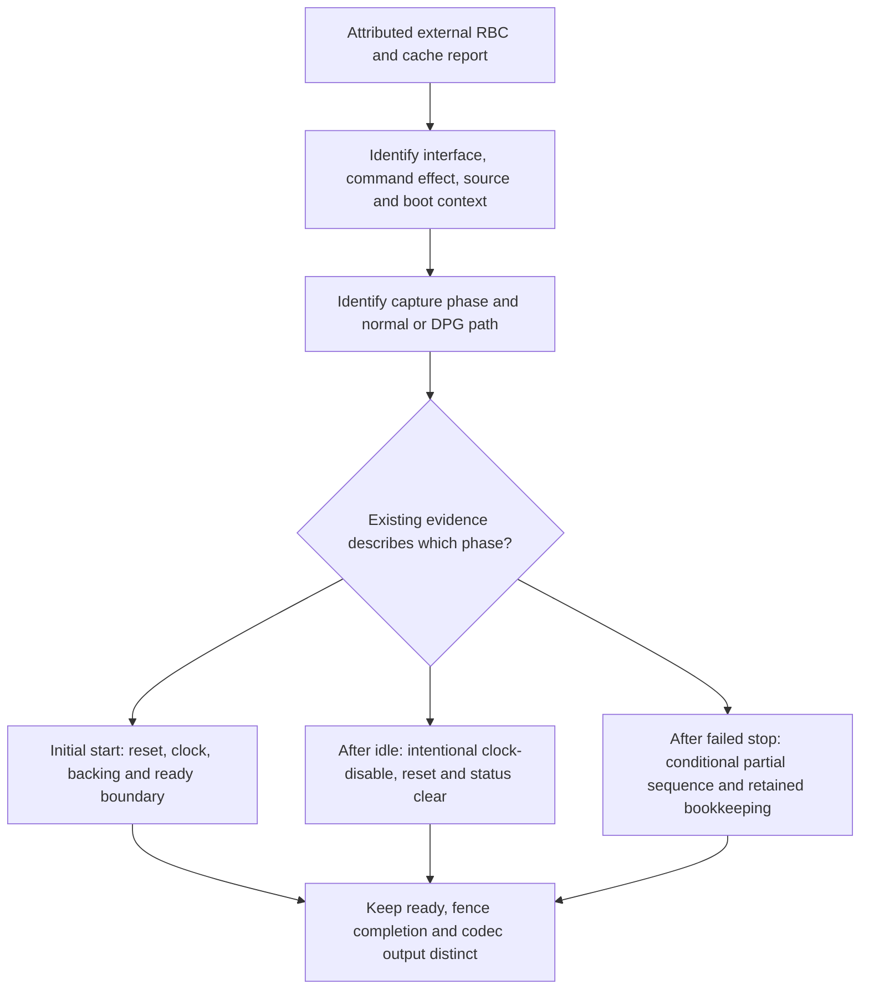

> This supplement records the lifecycle/completion extension. The later GPCNT report changes hypothesis priorities; use the final R265 handoff and LATEST_EXTERNAL_REVIEW.md for the current assessment.

# R251–R265 — VCPU execution boundary, extended September 30 research

The useful boundary is now more precise: **an attributable RBC effect, a firmware-ready indication, and VCPU instruction execution are separate observations.** The supplied community report motivates investigating their relationship, but does not yet identify the exact cache interface, command effect, source/boot configuration or capture phase needed to select a cause.

The strongest source results are the generation-specific reset distinction, normal ready-before-RBC ordering, and the lifecycle explanation for apparently inactive snapshots. This session establishes no new live VCN activation or hardware decode. The extended work adds normal shutdown and test-completion contracts to the [R260 detailed startup handoff](../../docs/CHATGPT_HANDOFF_R260.md).

## What changed in the extension

1. **A normal idle shutdown can produce the apparent inactive tuple.** Successful normal stop clears the VCPU clock-enable request, asserts VCPU reset and writes status zero. Those values after idle do not establish that earlier startup never succeeded. The delay is nominally 1000ms converted to jiffies, not an exact measured shutdown interval.
2. **A conditional partial-stop path needs separate attribution.** In the non-DPG path, a UMC stall request precedes the third checked wait. If that wait fails, stop returns before clock-disable/reset/status-clear. The wrapper retains its previous state. If it was UNGATE and no other state change intervenes, a later UNGATE can return zero without running start. This is bounded source reasoning, not an observed stall, reproduced defect or explanation of an initial cold-start failure.
3. **IB-test success has a narrower contract than error-free firmware service.** Decode/encode IB tests map a positive fence-wait result to zero without querying completion-error status. The current direct-submission path supplies an AMDGPU fence using the default wait. An already-signaled error fence with positive timeout is a conditional counterexample to equating that return with error-free completion. No such false positive was observed or induced here.
4. **Older sources preserve the core patterns but differ in lifecycle routing.** Six sampled revisions retain the limited stop-order/wrapper and test-return contracts. State storage, submission accounting, idle mutexes, callback routing and delayed-work cancellation differ. The current full lifecycle cannot be transplanted wholesale to an older modified kernel.
5. **“Cache register” and “PC” require precise interface definitions.** The reference header has 46 cache-related symbolic registers, including configuration and DPG/noncache variants. It also names trace/PC fields. Those names do not specify backing-byte access, instruction fetch, sampling validity or BC250 applicability. The two inspected VCN driver files do not implement a trace observation contract for those symbols.

These findings come from pinned normal Linux source: [VCN2 start/stop](https://github.com/torvalds/linux/blob/551c722f40809618230001baccf219193e22fc5a/drivers/gpu/drm/amd/amdgpu/vcn_v2_0.c), [VCN lifecycle and tests](https://github.com/torvalds/linux/blob/551c722f40809618230001baccf219193e22fc5a/drivers/gpu/drm/amd/amdgpu/amdgpu_vcn.c), [fence wait](https://github.com/torvalds/linux/blob/551c722f40809618230001baccf219193e22fc5a/drivers/dma-buf/dma-fence.c), and [reference field names](https://github.com/torvalds/linux/blob/551c722f40809618230001baccf219193e22fc5a/drivers/gpu/drm/amd/include/asic_reg/vcn/vcn_2_0_0_sh_mask.h). Source hashes and exact witnesses accompany each audit.

## Interpreting the reported state

| Report or saved observation | What it can establish with valid attribution | What it cannot establish alone |
|---|---|---|
| Cache configuration read/write agrees | Access to that configuration interface in that phase | Backing bytes, accepted firmware, instruction fetch |
| Decode write pointer changes | The identified pointer representation changed; doorbell mode can use a CPU shadow | Autonomous ring consumption |
| Independent effect of an identified ring command | The command path produced that effect under its stated conditions | Which hardware or firmware agent implemented it; codec readiness |
| Clock-enable request set and reset request clear, without ready | Supplied request bits and absent ready observation | Physical clock/reset state, no instruction ever executed, unique cause |
| Clock request clear, reset asserted, status zero after idle | Values compatible with successful normal shutdown | Earlier startup failure |
| Software UNGATE plus an LMI stall indication | Labels/fields needing phase attribution | A failed-stop cause without the preceding checked path and no intervening change |
| Status ready bit set | The normal source predicate is satisfied, if the read is valid | Freshness, complete firmware initialization, codec output |
| Decode/encode IB test returns zero | Its tested return contract, if the test actually ran | Error-free completion without fence status/provenance; decoded-frame correctness |
| Trace-like value or field named PC | A supplied value from an identified interface | Documented instruction retirement, freshness or exact BC250 semantics |

These are compatible explanations, not a diagnostic classifier. Several rows can coexist. No raw same-boot community capture was supplied, so this session cannot choose one explanation as the actual fault.

The diagram organizes existing evidence. It is not a device-operation sequence or a hardware dependency proof.

## Core distinctions retained from R260

- VCN2.0 reference reset release uses `UVD_SOFT_RESET.VCPU_SOFT_RESET`, mask `0x8`. Later sampled families use `UVD_VCPU_CNTL.BLK_RST`, mask `0x10000000`; that bit is named `CABAC_MB_ACC` in the 2.0 header. The 2.0.0 map is not an independently verified BC2502.0.3 silicon specification.
- Normal startup polls ready mask `0x2` before final RBC setup. Driver busy mask `0x4` differs. The DPG path has a different contract and indirect table contents are not live reads.
- Both inspected start paths set `RB_NO_FETCH=1` during initialization. Their lack of an explicit same-function zero assignment does not prove a bug or identify a missing host write.
- Upstream discovery does not add a VCN block in its 2.0.3 branch. The reference sequence is not native upstream BC250 enablement. Retained diagnostic source also has deliberate Cyan guards; neither source identifies the currently loaded external module.
- Ring allocation, missing power callbacks and same-state guards can report software success without proving a fresh VCPU start. The later test result is separate evidence.
- CC harvesting register fields, per-instance software harvest bits and whole-IP masks are different namespaces. Value3 is not interchangeable between them and does not, by itself, establish complete physical isolation.
- The retained firmware geometry is consistent for that file, but host bytes and placement bookkeeping do not prove accepted/resident executable bytes. Historical nonzero PSP response and zero placement are not current live cache-BAR evidence.
- Firmware version text, host-initialized log metadata, saved register dumps and debugfs labels have distinct contracts. Some reads also advance or process driver state. Their names do not make them independent execution measurements.

## Progress and reproducibility

| Stages | Result |
|---|---|
| R251–R252 | 28 ordered source phases; 134 lexical register-access sites across eight functions; applicability and return-path audit |
| R253 | Offline scalar interpreter and paired-capture comparison; missing/mismatched provenance stays unproven |
| R254–R255 | Six-revision startup comparison and one saved-firmware geometry audit |
| R256–R259 | Observation interfaces, five-generation reset comparison, startup preconditions and register/harvest provenance |
| R260 | Core handoff, external-claim attribution and public replay |
| R261 | 18 completion/test source witnesses and bounded function-body absence checks |
| R262 | 15 lifecycle witnesses and 13 ordered normal-stop phases |
| R263 | 11 bounded lifecycle/test invariants per sampled revision, with differences retained |
| R264 | Cache/trace naming inventory and limits of instruction-execution attribution |
| R265 | Extended handoff and reproducible source package |

R265's [replay instructions](REPLAY.md) reproduce the core and extension from hash-pinned public source. The default replay excludes private retained source and the saved firmware binary; the latter has an explicit optional local-file check. Offline/synthetic counts overlap and are not independent hardware trials or an equal number of discoveries.

R143 already established several callback, dropped-return, scratch-seed and geometry facts. R162 separated firmware-version metadata from execution, R163 modeled the ready loop, and R196 separated modified external PSP contexts from the normal path. Those earlier contributions are preserved. R249 remains a separate CPU checkpoint; R250 remains unfinished advisory work.

Q36 was used for bounded advisory review with GPU compute. Source-verified suggestions were retained; invented APIs, fault-injection suggestions, unsupported hardware claims and repetitive broad reviews were rejected. Raw model traces and raw external documents are excluded from publication.

## Still unresolved

The pre-ABL harvesting writer, a matching UEFI/SMU/PSP VCPU-release routine, and a verified P3/P5 versus Navi12/Ariel initialization difference were not established. No authentication bypass, boot patching or hardware fault reproduction was attempted. The external report's exact command and cache interface remain the main missing evidence, along with their source, firmware, mode and phase.

The most useful continuation is to interpret an existing sanitized same-boot record using these distinctions. There is no justification here for attributing all observations to one reset bit, declaring VCN physically dead, or claiming that VCPU execution has been achieved.
